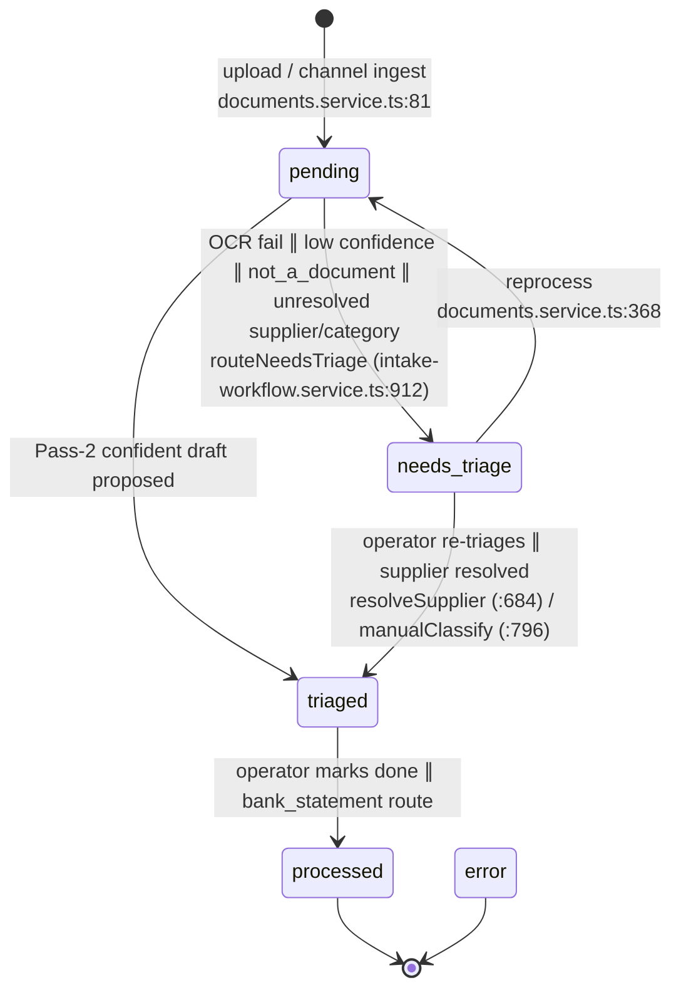
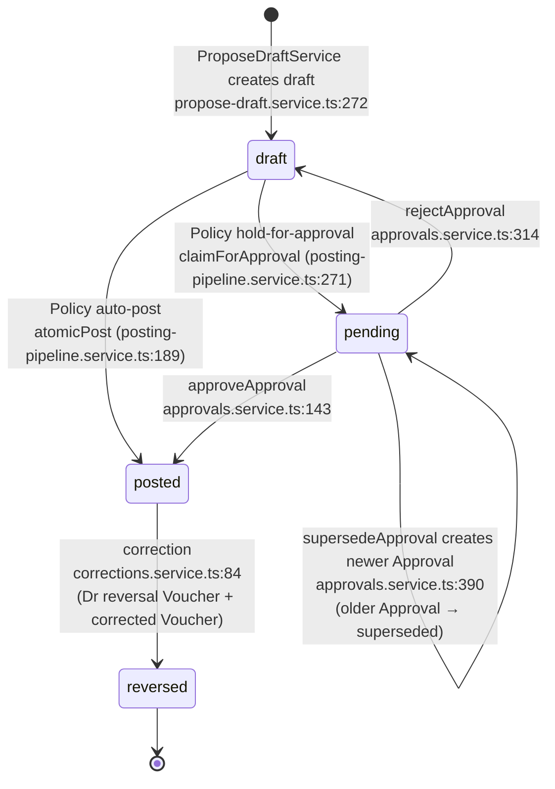
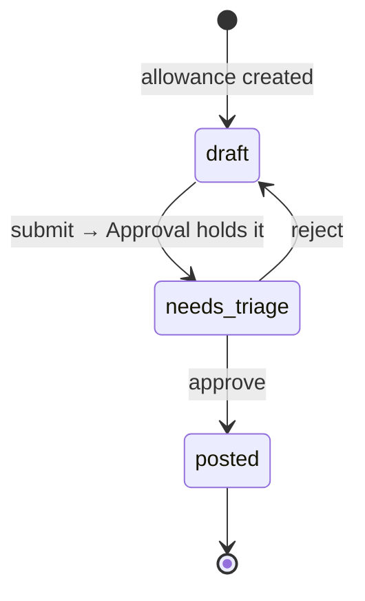
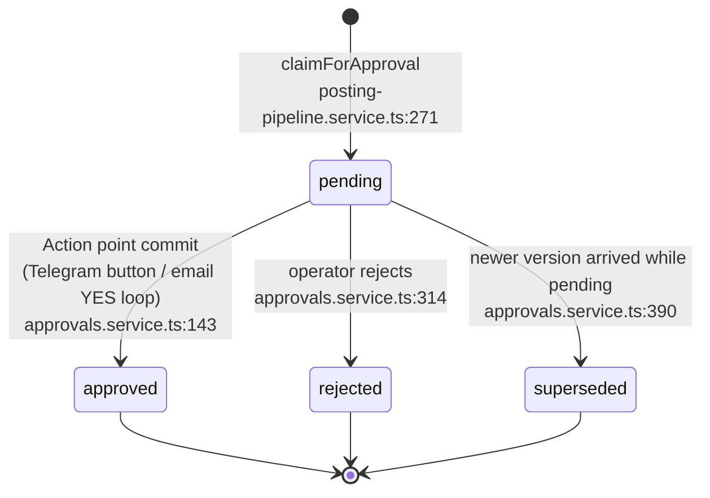
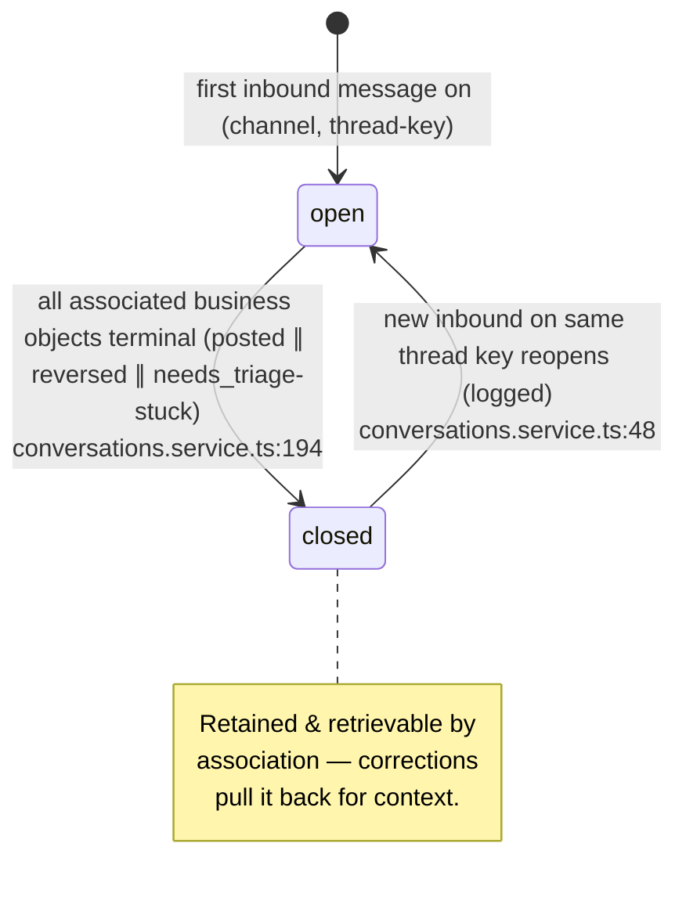
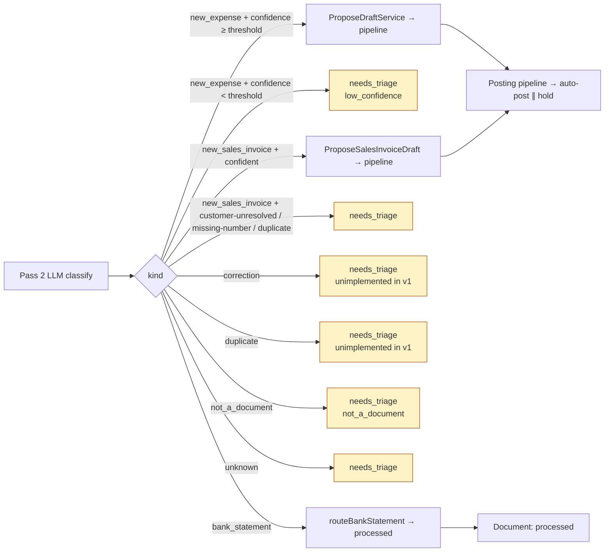
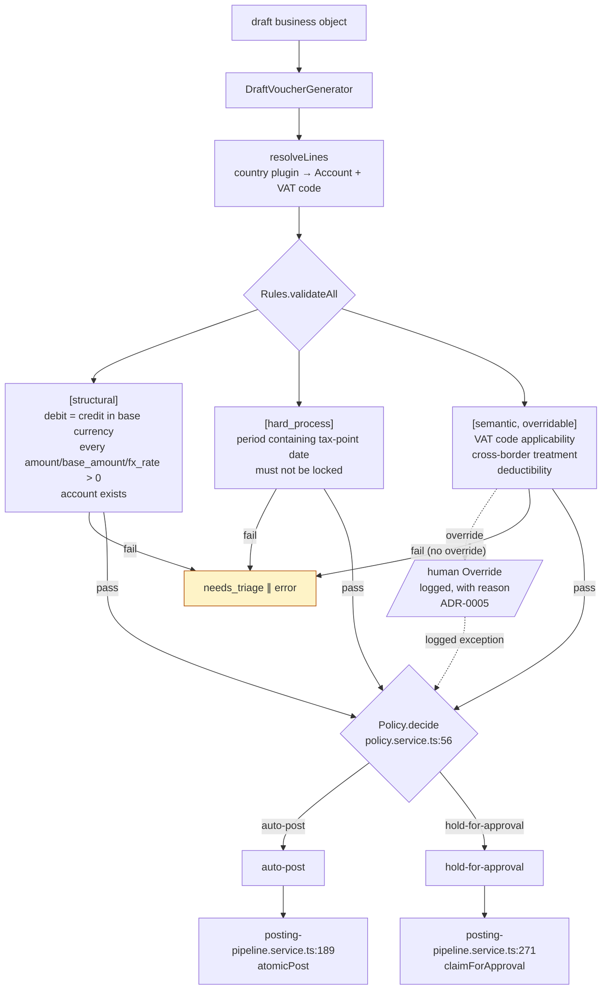
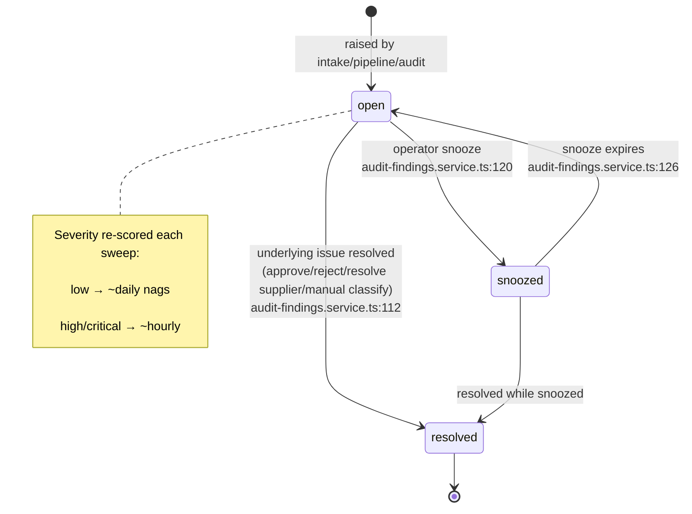

# Document → Voucher Journey Map

A Mermaid-journey view of how an inbound artifact becomes a posted **Voucher**,
layered over the actual state machines in the kernel. Every state name and
transition shown here mirrors the code — file:line citations appear in the
**Cross-references** table at the bottom, so this document can be kept in sync
as the kernel evolves.

> Scope: the v1 happy path from channel ingestion to a posted Voucher, plus all
> documented branches (`needs_triage`, `discarded`, `hold-for-approval`,
> `rejected`, `superseded`, `reversed`). Out of scope: payroll **Domain plugin**,
> bank reconciliation, year-end close (none exist in v1).

## How to read

- **Swimlanes** (subgraphs) are *who acts*, not where state lives.
  - `Channel` — the inbound edge (Telegram webhook, REST upload, IMAP sync).
  - `Intake` — `IntakeWorkflowService` + `IntakeQueueWorker`: OCR → Pass-2 → route.
  - `Draft` — `ProposeDraftService` + `PostingPipelineService`: AI propose → Rules → Policy.
  - `Approval` — `ApprovalsService` + Action point commit.
  - `Ledger` — `PostingService.postVoucherTx`: the Voucher lands, status → `posted`.
- **Node shapes**:
  - rounded rectangles are *states* (status values from typed enums);
  - sharp rectangles are *process steps / orchestrators*;
  - diamonds are *decisions* (Policy gate, triage router, Principal resolver);
  - hexagons are *terminal* outcomes.
- **Edge labels** are the trigger or guard. `∥` separates alternatives.

---

## 1. Top-level journey (channels → posted Voucher)

```mermaid
flowchart TB
  %% ───── Channels ─────
  subgraph Channel["Channel (inbound edge)"]
    direction TB
    TG["Telegram webhook<br/>telegram-webhook.controller.ts:38"]
    UP["REST upload<br/>POST /api/documents<br/>documents.controller.ts:71"]
    IMAP["Mailbox (IMAP) sync<br/>mail-sync.worker.ts:82<br/>(email_sync — ambient pull)"]
    PUSH["Email push<br/>(via Telegram-equivalent entrypoint)<br/>(email_push — deliberate)"]
  end

  %% ───── Unified envelope & router ─────
  ENV["Channel adapter<br/>maps payload → UnifiedEnvelope<br/>(telegram-mapper.ts:8, email/slack variants)"]
  ROUTER["InteractionRouterService.handle<br/>interaction-router.service.ts:60"]
  CONV["Conversation resolve/reopen<br/>conversations.service.ts:48<br/>(closed → open if thread key matches)"]
  PRIN{"Principal<br/>(approver | known_counterparty | unknown)<br/>principal/types.ts:1"}
  GATE{"ingestDecision<br/>(admit by channel + Principal?)"}
  QUEUE[("Intake queue<br/>intake-queue.worker.ts:69")]

  %% ───── Intake workflow ─────
  subgraph Intake["Intake (IntakeWorkflowService:289)"]
    direction TB
    P1["Pass 1: OCR transcribe<br/>(intake-workflow.service.ts:289)"]
    P2["Pass 2: LLM classify<br/>→ TriageResult.kind<br/>(triage/types.ts:91)"]
    ROUTE{"Triage router<br/>(intake-workflow.service.ts:466)"}
    DOC_STATE[("Document status:<br/>pending → triaged/needs_triage<br/>intake-workflow.service.ts:1001")]
  end

  %% ───── Draft & pipeline ─────
  subgraph Draft["Draft & Posting pipeline (posting-pipeline.service.ts:81)"]
    direction TB
    GEN["ProposeDraftService<br/>propose-draft.service.ts:272"]
    RESL["resolveLines<br/>(country plugin resolves Account + VAT code)"]
    RULES{"Rules.validateAll<br/>structural + hard_process + semantic<br/>(posting-pipeline.service.ts:81)"}
    POL{"Policy.decide<br/>policy.service.ts:56<br/>→ auto-post | hold-for-approval"}
  end

  %% ───── Approval ─────
  subgraph Approval["Approval gate (approvals.service.ts:143)"]
    direction TB
    HOLD["claimForApproval<br/>status draft→pending<br/>+ Approval(status='pending')<br/>+ AuditFinding('pending_approval')<br/>(posting-pipeline.service.ts:271)"]
    AP["Action point commit<br/>Telegram button ∥ email YES loop<br/>(interaction router gateCommit)"]
    ADEC{"P / R / S<br/>approveApproval ∥ rejectApproval ∥ supersedeApproval"}
  end

  %% ───── Ledger ─────
  subgraph Ledger["Ledger (PostingService.postVoucherTx)"]
    direction TB
    POST["atomicPost<br/>status draft→posted<br/>+ Voucher + VoucherLines<br/>+ hash-chain append<br/>(posting-pipeline.service.ts:189)"]
    VOUCH[("Voucher (immutable)<br/>ledger/voucher/types.ts:13<br/>(status lives on the business object)")]
    CCLOSE["Conversation close<br/>all objects terminal → open→closed<br/>conversations.service.ts:194"]
  end

  %% ───── Terminal exits ─────
  NT[/"needs_triage<br/>(AuditFinding types.ts:19)"/]
  DISC[("processed (no Voucher)<br/>Document marked processed/<br/>discarded at ingest")]
  REJ[("rejected → draft stays<br/>(Approval status='rejected')")]
  SUP[("superseded → newer version wins<br/>(Approval status='superseded')")]

  %% ───── Wiring ─────
  TG --> ENV
  UP --> ENV
  IMAP --> ENV
  PUSH --> ENV
  ENV --> ROUTER
  ROUTER --> CONV
  CONV --> PRIN
  PRIN -->|"approver/known_counterparty"| GATE
  PRIN -.->|"unknown"| NT
  GATE -->|"admit"| QUEUE
  GATE -.->|"discard (ambient pull)"| DISC
  QUEUE --> P1
  P1 -->|"OCR fail"| NT
  P1 -->|"OK"| P2
  P2 -->|"not_a_document"| NT
  P2 --> ROUTE
  ROUTE -->|"new_expense / new_sales_invoice"| GEN
  ROUTE -.->|"correction / duplicate / unknown"| NT
  ROUTE -.->|"bank_statement"| DOC_STATE
  GEN --> RESL
  RESL --> RULES
  RULES -->|"valid"| POL
  RULES -.->|"structural / hard_process fail"| NT
  POL -->|"auto-post"| POST
  POL -->|"hold-for-approval"| HOLD
  HOLD --> AP
  AP --> ADEC
  ADEC -->|"approved"| POST
  ADEC -.->|"rejected"| REJ
  ADEC -.->|"superseded (newer version)"| SUP
  POST --> VOUCH
  VOUCH --> CCLOSE
  %% approved posting also closes its Approval status
  POST -.->|"Approval pending→approved"| ADEC

  %% ───── Corrections connect back ─────
  VOUCH -.->|"later correction<br/>corrections.service.ts:84<br/>reverses+corrects_object"| POST

  classDef state fill:#e6f4ff,stroke:#2563eb
  classDef terminal fill:#fef3c7,stroke:#b45309
  classDef proc fill:#f0fdf4,stroke:#16a34a
  classDef decision fill:#fae8ff,stroke:#9333ea
  class VOUCH,DISC,REJ,SUP terminal
  class DOC_STATE state
  class PRIN,GATE,RULES,POL,ROUTE,ADEC decision
  class P1,P2,GEN,RESL,POST,HOLD,AP,ENV,ROUTER,CONV proc
```

---

## 2. Document state machine

`IntakeWorkflowService.transitionDocument` (intake-workflow.service.ts:1001)
guards every move. `processed` and `error` are terminal.

Note: `discarded` from the CONTEXT glossary is the **ambient-pull** disposition
(`email_sync` mailbox sync) — at the code level it materializes as a Document
left in `needs_triage`-equivalent handling, OR marked straight to `processed`
depending on the Ingest profile decision. Both stop short of producing a draft.

---

## 3. Business Object state machine (Expense / SalesInvoice)

Guarded by `StatusTransitionService.transition` (status-transition.service.ts:155).
Status lives on the business object; the Voucher is just the posted projection.

### Allowance (own machine — status-transition.service.ts:51)

---

## 4. Approval state machine

Never auto-resolves (ADR-0012). A timeout sends a reminder via
`SecretaryAgent` — never auto-posts or auto-discards.

### Action point commit surface

| Channel            | Commit signal                                | Auth gate                                  |
| ------------------ | -------------------------------------------- | ------------------------------------------ |
| Telegram / Slack   | Inline button tap → callback → `gateCommit` | Principal `approver` AND `authVerified`   |
| Email (push)       | Confirmation loop: explicit **YES** only     | Whitelist (approver ⊆ whitelist) + DKIM/SPF |
| REST / CLI         | Operator API call (out-of-band auth)         | Approver session                           |

The free-chat context leading up to the commit is governed by ADR-0016
(intent routing) — the commit itself is gated separately.

---

## 5. Conversation state machine

Wraps the journey above — `Conversation` is the operational record, not part
of the hash-chained ledger.

---

## 6. Intake routing decisions

What `Pass 2` (LLM classify) chooses, and where each branch routes.
`TriageResult.kind` is from `triage/types.ts:91`; the right-hand reason tags are
`TriageReasonType` from `triage/types.ts:221`.

---

## 7. Posting pipeline (Rules → Policy → post)

Decomposition of the **Draft & pipeline** swimlane. `PolicyAction` is
`'auto-post' | 'hold-for-approval'` (`policy/types.ts:9`).

---

## 8. AuditFinding nag loop (orthogonal but visible from the journey)

The `needs_triage` and `pending_approval` exits above don't just stop the
flow — they raise an `AuditFinding` that the `SecretaryAgent` nags about
on a severity-driven cadence.

---

## Cross-references

State machines, transition functions, and entrypoints cited above.

| Aggregate / concern      | Definition (file:line)                                  | Transition guard / actor (file:line)                                              |
| ------------------------ | ------------------------------------------------------ | -------------------------------------------------------------------------------- |
| `BusinessObjectStatus`   | `packages/server/src/common/types/business-object-status.ts:1` | `ledger/status/status-transition.service.ts:33-42`                       |
| `DocumentStatus`         | `packages/server/src/documents/types.ts:18`            | `ai/intake-workflow.service.ts:1001` (guarded graph) + `documents.service.ts:332` |
| `ApprovalStatus`         | `packages/server/src/approvals/types.ts:10`            | `approvals.service.ts:143 / :314 / :390`                                         |
| `ConversationStatus`     | `packages/server/src/conversations/types.ts:5`         | `conversations.service.ts:48 / :194`                                             |
| `FindingStatus`          | `packages/server/src/audit-findings/types.ts:76`       | `audit-findings.service.ts:112 / :120 / :126`                                   |
| `PolicyAction`           | `packages/server/src/policy/types.ts:9`                | `policy.service.ts:56-128`                                                       |
| `PrincipalRole`          | `packages/server/src/interaction/principal/types.ts:1` | `interaction-router.service.ts:60` (Principal resolver)                          |
| `TriageResult.kind`      | `packages/server/src/triage/types.ts:91`               | `ai/intake-workflow.service.ts:466` (route)                                      |
| Inbound: Telegram webhook| `interaction/channels/telegram/telegram-webhook.controller.ts:38` | `telegram-mapper.ts:8` (payload → envelope)                              |
| Inbound: REST upload     | `documents.controller.ts:71`                           | `documents.service.ts:81` (creates Document in `pending`)                       |
| Inbound: Mailbox IMAP    | `mailbox/mail-sync.worker.ts:82`                       | `mailbox/harvest.service.ts:15`                                                 |
| Interaction router (all) | `interaction-router.service.ts:60`                     | `InteractionRouterService.handle()`                                              |
| Intake queue worker      | `intake-queue/intake-queue.worker.ts:69`               | `IntakeQueueWorker.drainLoop()`                                                  |
| Posting pipeline         | `ledger/pipeline/posting-pipeline.service.ts:81-179`   | `posting-pipeline.service.ts:189 / :271`                                         |
| Draft proposer           | `ai/propose-draft.service.ts:272`                      | `:508 / :591 / :697`                                                             |
| Voucher posting (ledger) | `ledger/voucher/types.ts:13`                           | `PostingService.postVoucherTx` (called from `atomicPost`)                        |
| Corrections              | `corrections/corrections.service.ts:84-100`            | `correctExpense / correctSalesInvoice`                                           |

## ADRs that shape this journey

- **ADR-0005** — posting pipeline & overrides (semantic rules overridable, with reason).
- **ADR-0006** — business object is the source, Voucher is the projection.
- **ADR-0010** — intake, triage, dedup, corrections.
- **ADR-0012** — no break-glass (approvals never auto-resolve).
- **ADR-0013** — cryptographic integrity (hash-chained voucher log; Voucher is immutable once posted).
- **ADR-0015** — approval lifecycle & period lock (`hard_process` rule: period must be open).
- **ADR-0016** — intent routing & free-chat with action buttons (the *free conversation* vs. *Action point* distinction).
- **ADR-0018** — Mastra working memory (transient conversation context, distinct from the `Conversation` aggregate here).
- **ADR-0019** — ledger write path & invariant enforcement (Rules are inviolable for everyone including humans).
- **ADR-0020** — voucher minted only at posting (a draft is never a Voucher).
- **ADR-0024** — two-pass AI intake OCR (Pass 1 transcript → Pass 2 classify).
- **ADR-0025** — channel adapter seam (mapper vs. transport port; this is why every channel funnels through the unified envelope).
- **ADR-0026** — operational audit log (gating decisions written here; distinct from the hash-chained ledger).
- **ADR-0038** — delivery channels (deliberate-push vs. ambient-pull Ingest profile; governs the `discarded` vs. `needs_triage` disposition).

---

## Maintenance

When you change a status string, a transition graph, or an entrypoint:

1. Update the relevant `stateDiagram-v2` / `flowchart` block above to match the new code.
2. Update the **Cross-references** table row with the new file:line.
3. Add or amend an ADR if the change is a decision, not just a refactoring.

The Mermaid blocks render on GitHub and GitLab; no CI step is required to keep
them current, but a `grep` for state string literals will surface drift if run
periodically.